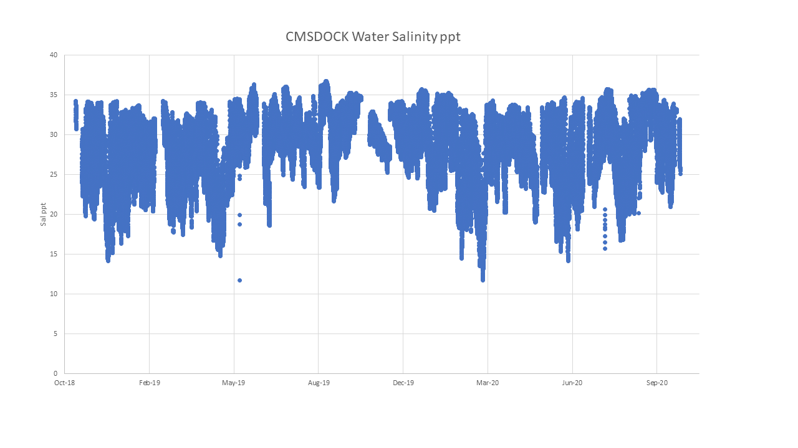

# Map of populations (marked with a P) and datasources locations:

https://www.google.com/maps/d/edit?mid=1R5Ca6k8ODP3jSXcJY2soHCY6EmfLVFd-&usp=sharing

> At this point, NC populations are not defined as High, Med or Low.

# COMPARE SOURCES
> The only datasource listed for this population for both temperature and salinity is UNCW_CORMP_CMSDOCK_station, so nothing to compare to.

# PopID: NC_WI_HC_XXX_W - Temperature
* Erin's notes: Temperature in Celsius, data in 15 minute increments. 2018-2020. Jan-Nov.	Salinity in ppt, data in 15 minute increments. 2018-2020. Jan-Nov.
* Thais's notes: Temp in Celsius, data in 15 min increments. 2018 (Nov-Dec), 2019 (whole year), 2020 (Jan-Oct) - this is an active station so data is likely to be continuously added. Quality control not included, file says "quality non evaluated". I deleted the first day of data that seemed off (9-Nov-2018), all zeros and all -6999 (probably code for missing data).

# PopID: NC_WI_HC_XXX_W - Salinity
* Erin's notes: Jan-Nov.	Salinity in ppt, data in 15 minute increments. 2018-2020. Jan-Nov.
* Thais's notes: Salinity in ppt, data in 15 min increments. 2018 (Nov-Dec), 2019 (whole year), 2020 (Jan-Oct) - this is an active station so data is likely to be continuously added. I deleted all salinity values below 5 as they seemed like outliers for the location.

