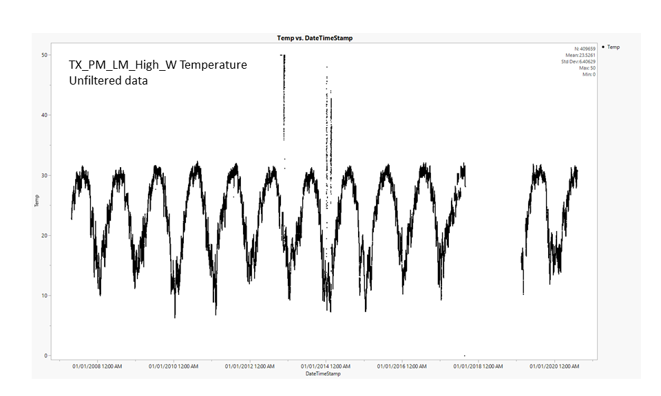
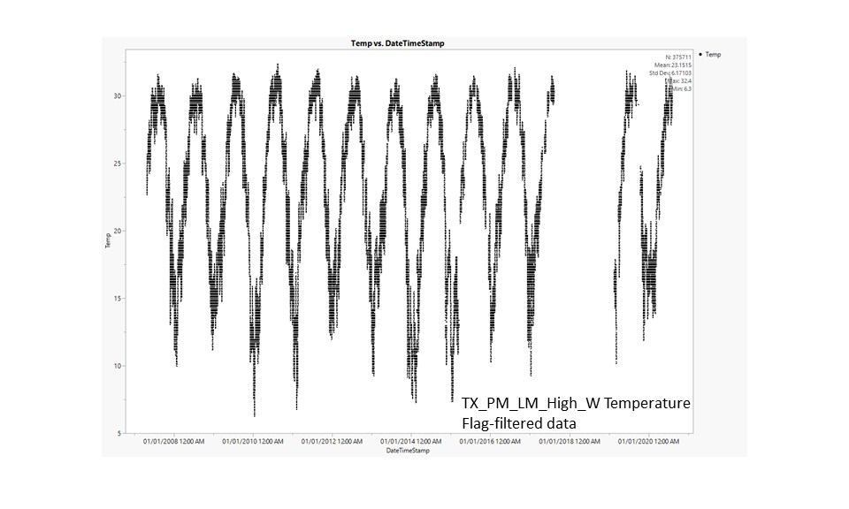
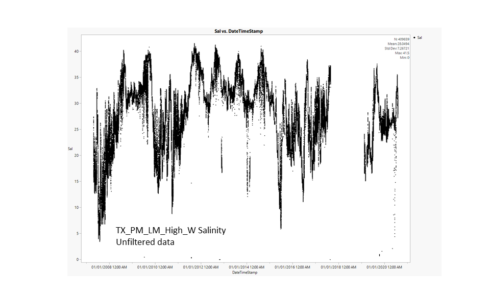

# 2020-10-30, Thais' notes following meeting:

# Pop ID: TX_PM_LM_High_W

# Map:

Lat/long for population and datasources are exact.

https://www.google.com/maps/d/edit?mid=1Bngk3iR1x3HiLXNzWZhapCoXpiRGOVJY&ll=27.253287416698107%2C-97.19685&z=8

## Summary notes:

NERR_MARABWQ is ok for both temperature and salinity; both temp and sal have been flag-filtered (this eliminates data that didn't pass quality control by the provider).

## Summary table:

| Parameter             | Temp C NERR Flag-filtered | Sal C NERR Flag-filtered |
| ----------------------| :-----------------------: | :----------------------: |
| N_all_datapoints      |      373291               |       350150             |
| Mean_all_datapoints   |       23.1                |        28.1              |
| StdDev_all_datapoints |       6.2                 |        7.2               |
| N_years               |       13                  |         13               |
| Mean_yearly_max       |       31.7                |         38.0             |
| StdDev_yearly_max     |        0.3                |         2.9              |
| Mean_yearly_min       |       9.6                 |       15.5               |
| StdDev_yearly_min     |        2.3                |        7.1               |
| Data range            |Apr 2007 to Aug 2020 missing Sep 2017 to Jan 2019|Apr 2007 to Aug 2020 missing Sep 2017 to Jan 2019|
| Data frequency        |   every 15 min            |       every 15 min       |
| Missing winter        |    FALSE                  |        FALSE             |

## Data source and filenames:

Website: http://cdmo.baruch.sc.edu/dges/

Temp: TX_PM_LM_High_W_Temp.xlsx

Sal: TX_PM_LM_High_W_Sal.xlsx

---

# 2020-10-29

## KEL notes
- use flag-filtered data. DONE, see summary table above (TB).
- 

---

# 2020-09-29

# PopID: TX_PM_LM_High_W

**COMPARE SOURCES**

> No sources to compare, NERR Buoy MARABWQ is the only datasource listed for both temperature and salinity.

I'm using an updated version (data range: 2007-2020) of the file originally provided by Erin (data range: 2007-2017).

**BEST DATASETS**

## PopID: TX_PM_LM_High_W Temperature - filtration steps to clean dataset

| Parameter      | Unfiltered | Flag-filtered | Historical-filtered | Provisional-filtered |
| ---------------| ---------- | ------------- | ------------------- | -------------------- |
| N_all          | 409659     |  373291       |  195868             |                      |
| Mean_all       |  23.5261   | 23.1212       |  23.1322            |                      |
| StdDev_all     |  6.4063    |  6.1776       |  6.3136             |                      |
| Max_all        | 50         |  32.4         |  32.4               |                      |
| Min_all        | 0          |  6.3          |   6.3               |                      |
| N_years        |  13        |  13           |   7                 |                      |
| Mean_max_years | 34.45      | 31.69         |  31.77              |                      |
| Mean_min_years | 8.931      | 9.646         | 9.143               |                      |
| dd_0           |  0         |  0            |   0                 |                      |
| dd_15          |  360290    |  325275       |  168199             |                      |
| dd_30          |  56414     | 45611         |  27029              |                      |

Notes: 

**Data is patchy in Aug 2017; large gap in the data with missing temp data ~Sep 2017 to mid-Feb 2019; then patch again in Mar-2019.**

**Flag-filtered** - *This is the most important step, gets rid of data outside of sensor range, QAQC rejected, missing data, field or instrument maintenance days, cause unknown, instrument or sensor malfunction, data collected at wrong depth, etc. *

**Historical-filtered** - "A value of 0 in the historical column indicates that the data have not been through final QAQC by the CDMO. A value of 1 indicates that the data have been through final tertiary review at the CDMO and posted as the final authoritative data. (from data provider)" 
>*I think this is the final data after an annual round of QC, so the current year is likely to be filtered out (2020 in this case). For this dataset, it seems like some random years were not through the final tertiary review. I don't think we need this filter.*

**Provisional-filtered** - *Historical-filtered data only contained provisional = 1 data, i.e., nothing left to filter out.*

## PopID: TX_PM_LM_High_W Salinity - filtration steps to clean dataset

| Parameter      | Unfiltered | Flag-filtered | Historical-filtered | Provisional-filtered |
| ---------------| ---------- | ------------- | ------------------- | -------------------- |
| N_all          |  409659    | 350150        |  177891             |                      |
| Mean_all       |  28.0494   | 28.1148       |  25.6199            |                      |
| StdDev_all     |  7.2672    |  7.1802       |  7.6145             |                      |
| Max_all        | 41.5       |  41.5         |  40.8               |                      |  
| Min_all        | 0          |  3.5          |   3.5               |                      |
| N_years        |  13        |  13           |   7                 |                      |
| Mean_max_years | 38.21      | 38.01         |  36.87              |                      |
| Mean_min_years | 6.369      | 15.462        | 13.043              |                      |

**Data is patchy in Aug 2017; large gap in the data with missing temp data ~Sep 2017 to mid-Feb 2019; then patch again in Mar-2019.**

**Flag-filtered** - *This is the most important step, gets rid of data outside of sensor range, QAQC rejected, missing data and other flagged data such as field or instrument maintenance days, cause unknown, instrument or sensor malfunction, data collected at wrong depth, biofouling, incorrect calibration due to contaminated standard, post calibration out of range, etc.*

**Historical-filtered** - "A value of 0 in the historical column indicates that the data have not been through final QAQC by the CDMO. A value of 1 indicates that the data have been through final tertiary review at the CDMO and posted as the final authoritative data (from data provider)" 
>*I think this is the final data after an annual round of QC, so the current year is likely to be filtered out (2020 in this case). For this dataset, it seems like some random years were not through the final tertiary review. I don't think we need this filter.*

**Provisional-filtered** - *Historical-filtered data only contained provisional = 1 data, i.e., nothing left to filter out.*

