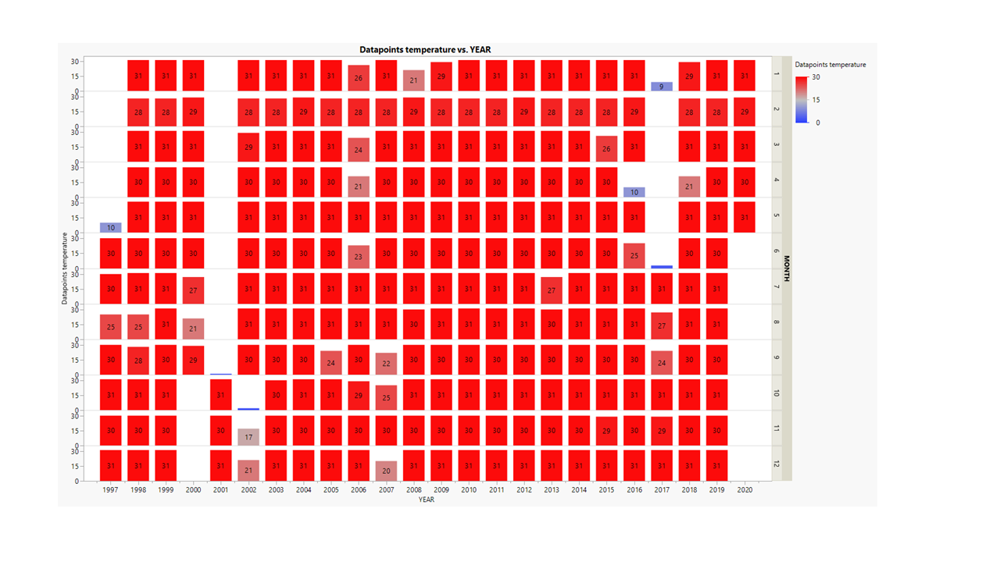
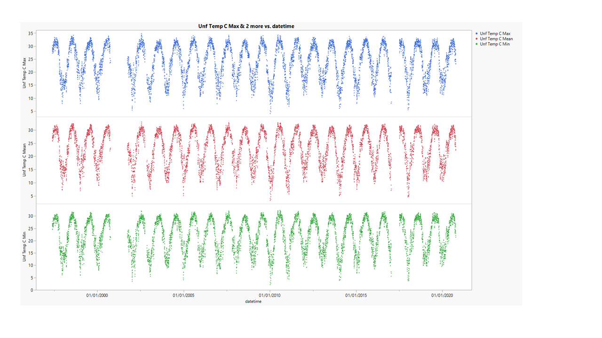
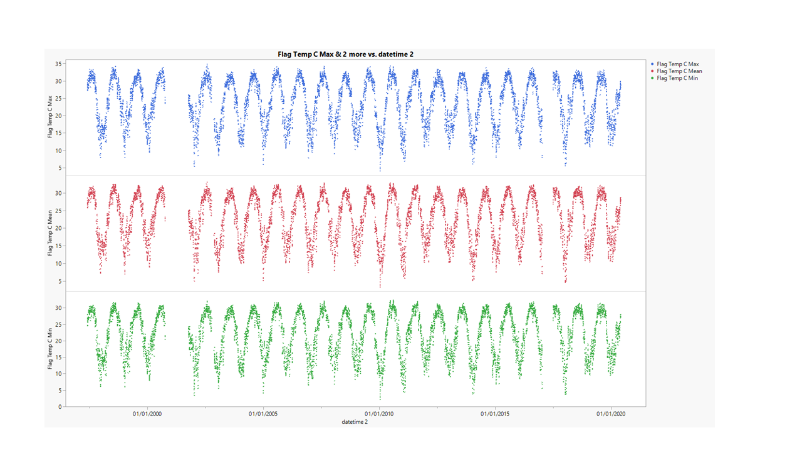
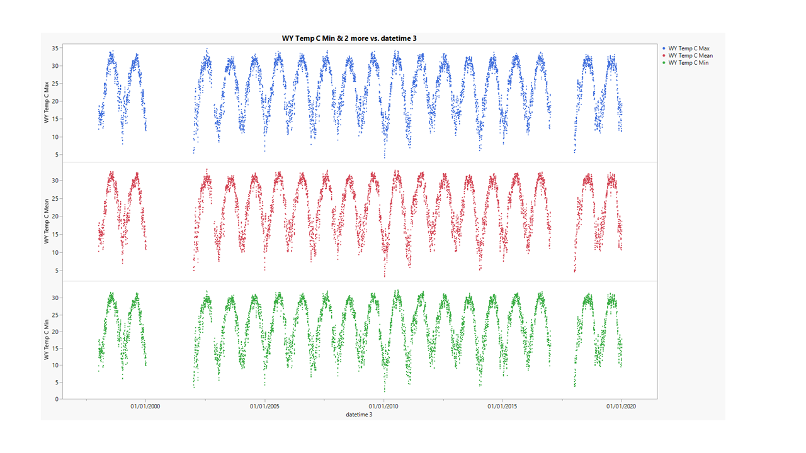
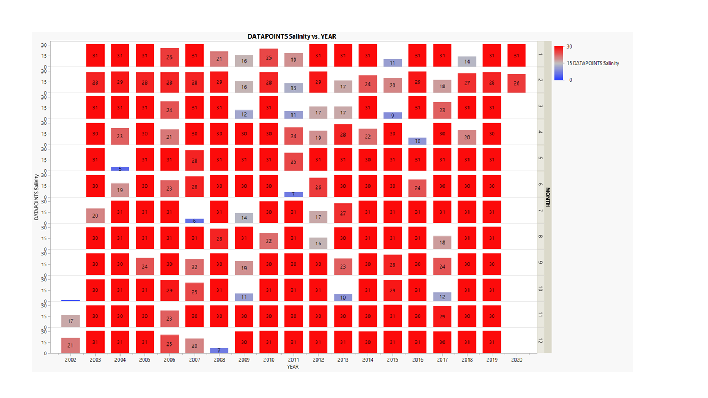
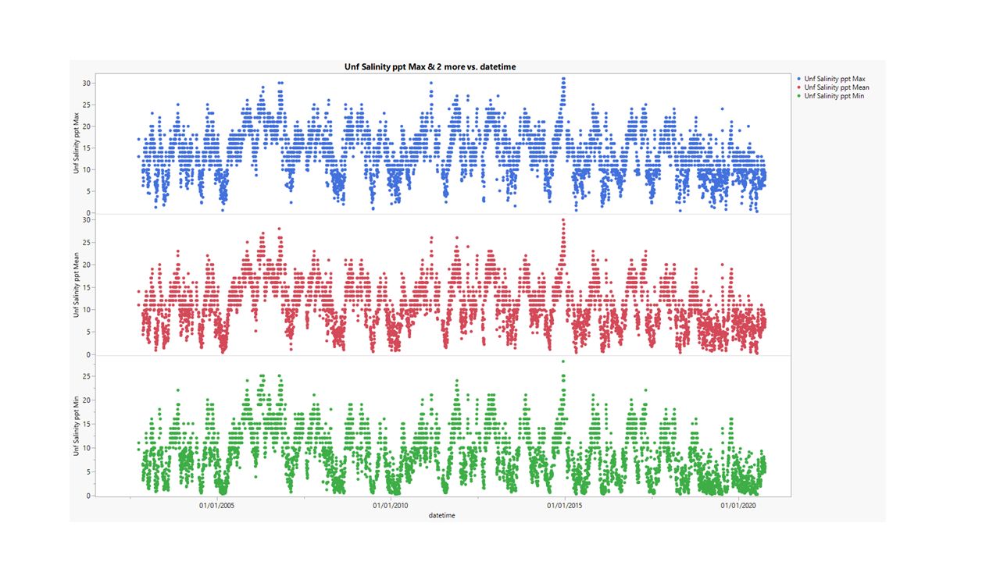
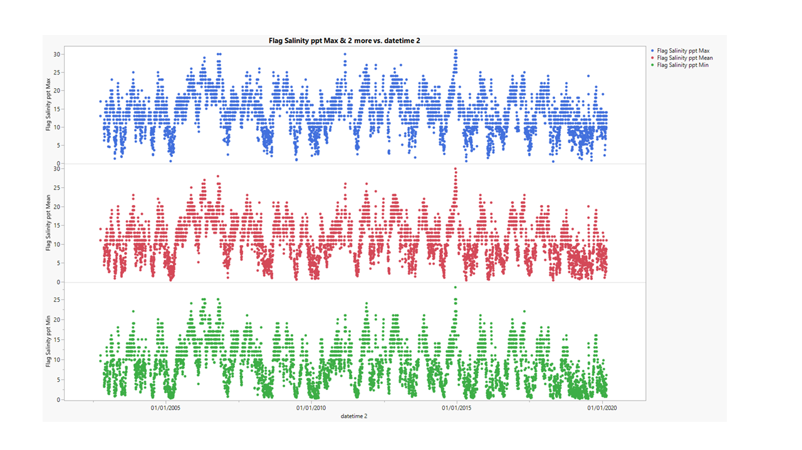
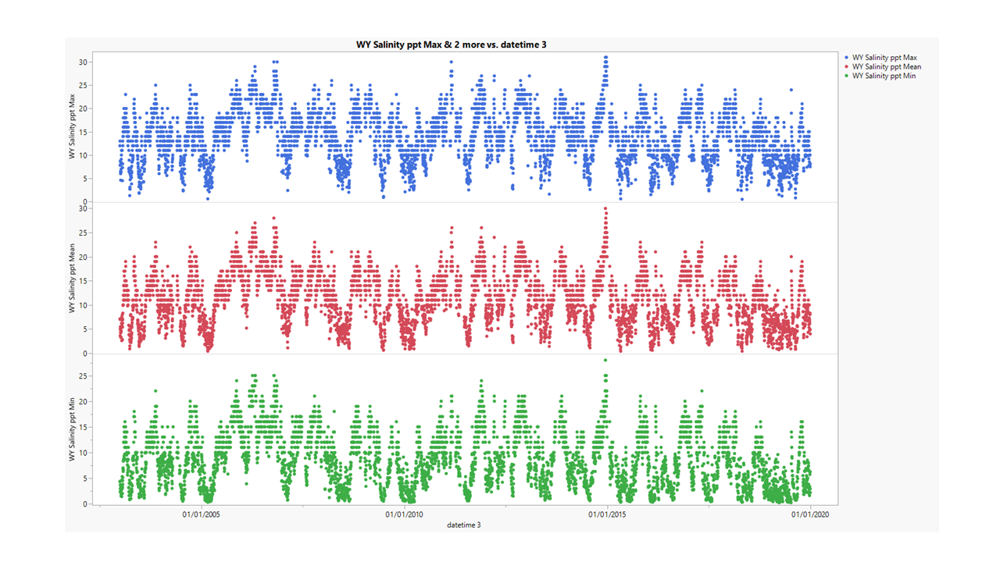

# 2020-11-02, Thais' notes following meeting:

# Pop ID: LA_CL_SL_Low_W

## Map:

Lat/long for population is unknown so using lat/long of data sources. Erin's note: *APPROXIMATE-none provided by sampler, taken from USGS buoy 07381349 (where env data was collected)*

https://www.google.com/maps/d/edit?mid=1ekp4X3Lazwpz1pZ6XkJQMKlqotFGnN9E&ll=29.679165838880575%2C-92.55728648730468&z=9

## Summary notes:

USGS Sister Lake buoy 07381349 is ok for temperature and salinity; both temp and sal data have been flag-filtered to include approved "A" data and exclude provisional "P" data (this eliminates data that didn't pass quality control by the provider, or hasn't yet been through QC).

Data is given as Daily Mean, Max and Min; in the Summary Table below:

-Mean_all and StdDev_all were calculated from Daily Means,
-Mean and StdDev yearly_max were calculated from Daily Maxs,
-Mean and StdDev yearly_min were calculated from Daily Mins.

## Summary table:

| Parameter             | Temp C USGS Flag-filtered | Sal ppt USGS Flag-filtered |
| ----------------------| :-----------------------: | :------------------------: |
| N_all_datapoints      |           7661            |           5616             |
| Mean_all_datapoints   |            22.9           |             11.1           |
| StdDev_all_datapoints |             6.7           |             5.4            |
| N_years               |            24             |              19            |
| Mean_yearly_max       |             33.1          |              25.2          |
| StdDev_yearly_max     |             1.8           |              3.4           |
| Mean_yearly_min       |              6.9          |              0.9           |
| StdDev_yearly_min     |              2.3          |              1.0           |
| Data range            | May 1997 to May 2020      |    Nov 2002 to Feb 2020    |
| Data frequency        | Daily Mean, Min, Max      |    Daily Mean, Min, Max   |
| Missing winter        |        FALSE              |         FALSE              |

## Data source and filenames:

Website: https://waterdata.usgs.gov/la/nwis/uv/?site_no=07381349&PARAmeter_cd=00065,72020,63160,00060

Temp: LA_CL_SL_Low_W_Temp.xlsx

Sal: LA_CL_SL_Low_W_Sal.xlsx

---
# 2020-10-29

## KEL notes
- Use flag filtered
- Delete the dd results
---

# 2020-10-06

# PopID: LA_CL_SL_Low_W
---

**COMPARE SOURCES**

> No sources to compare, USGS station 07381349 is the only datasource listed for both temperature and salinity.

I'm using an updated version (data range: 1997-2020) of the file originally provided by Erin (data range: 2002-2016).

**BEST DATASETS** - these are daily max, daily min and daily mean datasets.

## PopID: LA_CL_SL_Low_W Temperature - filtration steps to clean dataset

| Parameter            | Unfiltered | Flag-filtered  | Whole-yrs only |
| ---------------------| ---------- | -------------- | -------------- |
| N_daily_mean         |   7788     |     7661       |     6755       |
| Mean_daily_means     |   23.03    |     22.93      |     22.89      |
| StdDev_daily_means   |   6.647    |       6.652    |      6.710     |
| N_years              |    24      |       24       |      19        |
| Mean_yearly_max      |     33.28  |       33.15    |      33.63     |
| Mean_yearly_min      |     6.91   |       6.91     |      6.64      |
| Mean_yearly_dd_0     |      0     |       0        |       0        |
| Mean_yearly_dd_15    |     284    |       279      |      309       |
| Mean_yearly_dd_30    |     82     |       80       |       89       |

Table notes: 

**Flag-filtered** - For USGS datasets: "Data-value qualification codes included in this output: ***  Value unavailable; A  Approved for publication -- Processing and review completed; P  Provisional data subject to revision (from provider)". *"Flag-filtered column" has data flagged "A" only (F and *** excluded).*

**Whole-yrs only** - original range: 1997-2020; years excluded 1997, 2000, 2001, 2017, 2020 (based on data map below).

---

**Plot showing data distribution by year and month - the numbers inside the boxes are the number of datapoints per month in each year; full datasets = 31 (for months with 31d), 30 (for months with 30d), 29 or 28 (for February, leap and reg years)** This is to see if there's any 'wholes' in the dataset (missing too many winters or summers, etc) that could bias the calculated means in the table above. - this is more relevant for temperature than for salinity, but I plotted for both.

---

**Plots showing data filtration steps - temperature**

---

## PopID: LA_CL_SL_Low_W Salinity - filtration steps to clean dataset

| Parameter          | Unfiltered | Flag-filtered     | Whole-yrs only |
| -------------------| ---------- | ----------------- | -------------- |
| N_daily_mean       |   5838     |     5618          |     5521       |
| Mean_daily_means   |   10.93    |      11.13        |      11.19     |
| StdDev_daily_means |    5.405   |       5.392       |       5.404    |
| N_years            |        19  |        19         |       17       |
| Mean_yearly_max    |    25.21   |       25.16       |       26.0     |
| Mean_yearly_min    |    0.83    |         0.86      |        0.73    |

Table notes:

**Whole-yrs only** - original range: 2002-2020; years excluded 2002, 2020 (based on map below).

**Flag-filtered** - For USGS datasets: "Data-value qualification codes included in this output: ***  Value unavailable; A  Approved for publication -- Processing and review completed; P  Provisional data subject to revision (from provider)". *"Flag-filtered column" has data flagged "A" only (F and *** excluded).*

---

**Plot showing data distribution by year and month - the numbers inside the boxes are the number of datapoints per month in each year; full datasets = 31 (for months with 31d), 30 (for months with 30d), 29 or 28 (for February, leap and reg years)** This is to see if there's any 'wholes' in the dataset (missing too many winters or summers, etc) that could bias the calculated means in the table above. - this is more relevant for temperature than for salinity, but I plotted for both.

---

**Plots showing data filtration steps - salinity**

