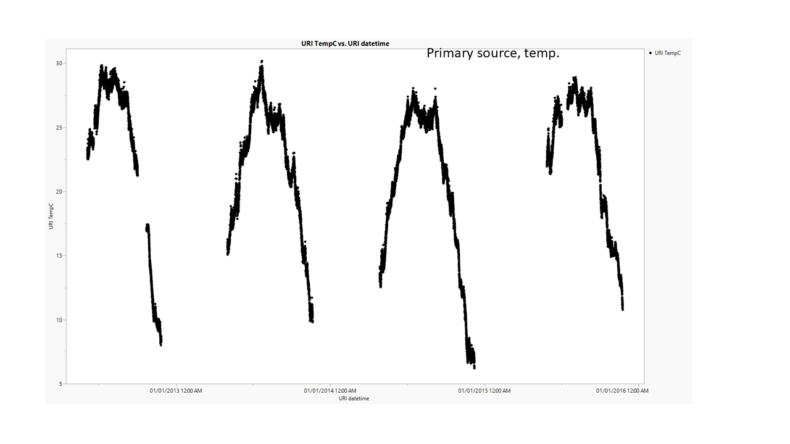
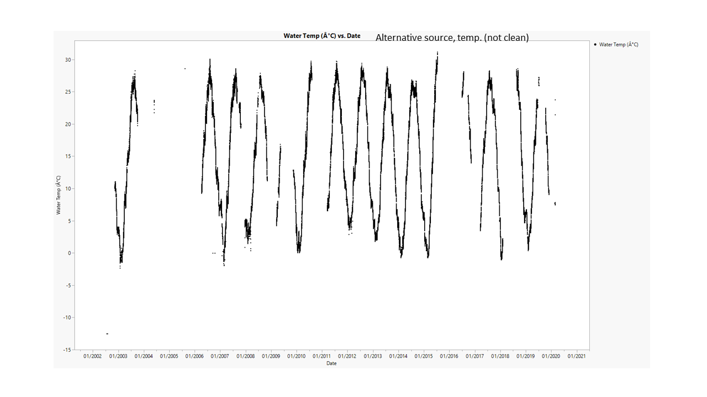
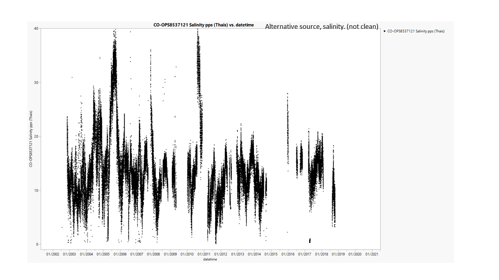
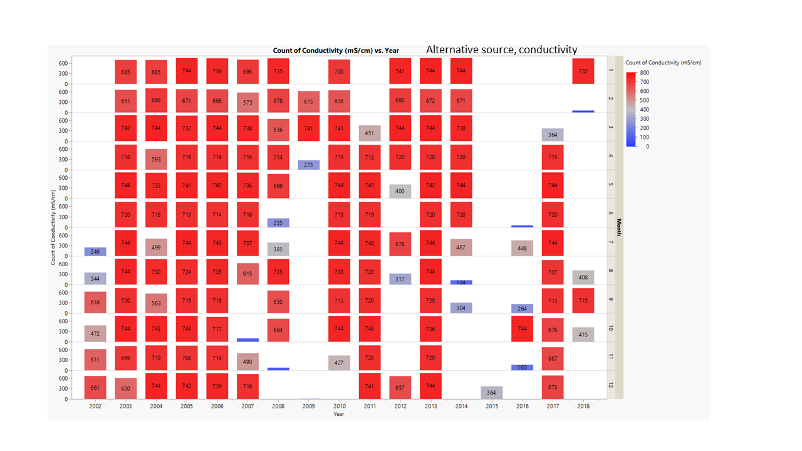
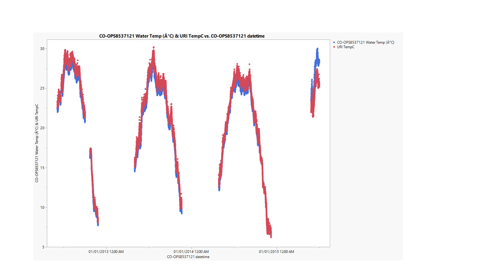
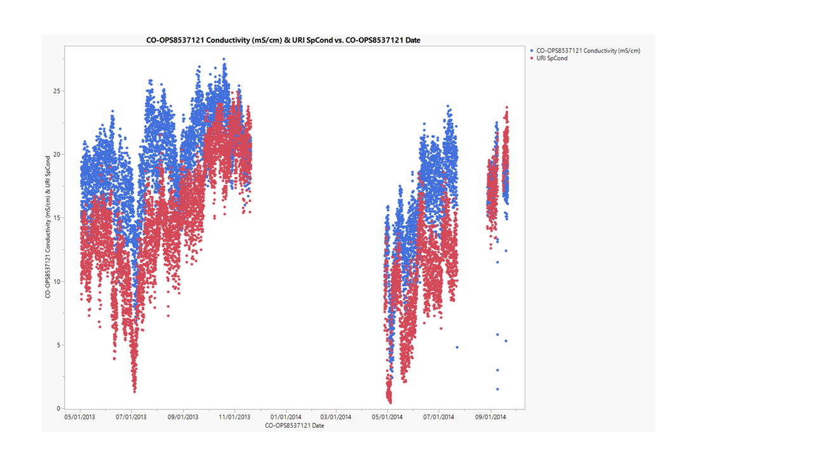
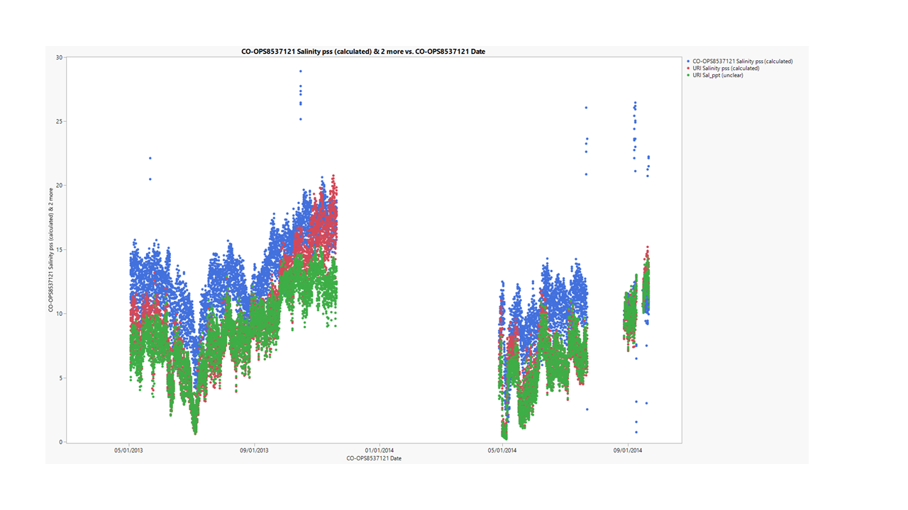
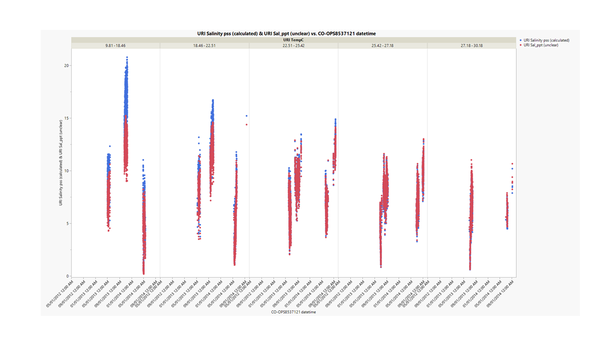

# 2020-10-16

## KEL notes
- there is a lot going on here that I may need to you to explain so I can summarize in my own words
---

# PopID: NJ_DB_HC_Low_W
---

**COMPARE SOURCES**

Notes on the data sources:

**Primary source:** URI Gomez Chiarra Hope Creek 2012-2015

> Data from each year in separate tabs, I compiled into one tab. Most of the data is in 1/2 hour resolution, with a small window (late May to late June, 2015), every hour.

**Temperature** in C for all years: 2012 June-November; 2013 May-November; 2014 April-December; 2015 May-December. **Missing coldest months.**

**Salinity**: 2012 has one column labelled salinity, no units. 2013, 2014, 2015 have two columns, one labelled SpCond (no units in 2013) and one labeled Salinity_ppt (unclear if it was measured or calculated from SpCond).

> For 2013-2015, I calculated salinity from conductivity (assuming units are mS/cm for 2013) and temperature. Those calculated salinity values are **not** an exact match to the values in the Salinity_ppt column. The Salinity_ppt column is a factor of ~1.7 of the SpConduc. I don't know if the salinity_ppt values are calculated or measured. If they are calculated, perhaps they did not take temperature brackets into account in their calculations. Can we ask Erin/Dina to ask their source. 

**Secondary source:** Rutgers data: Delaware Bay 2006-13.xlsx .( https://hsrl.rutgers.edu/HSRL%20documents/Water%20Temperature/index.temperature.html.)

> This is a secondary data source for temperature listed in EasternOysterSeascapeData but Erin's notes say "Rutgers Delaware Bay 2006-13.xlsx only spreadsheet with Hope Creek temperature data with 1/month data points and missing winter - no good - also assume in Celcius. Data is from 2011 (April-Oct, 1 data point per month), 2012 (May-Oct. 1 data point per month), 2013 (April, July-Nov, 1 data point per month)." *I'm not using it.*

**Alternative source (maybe, check with Katie):**

> I found another NOAA station (Ship John Shoal) that might work for this population and has some temp and salinity data. I am comparing this to the primary source to see if we can get a better dataset for this population.

----

Outstanding questions about data for this population:

1) There is no lat and long for the primary datasource, so it is unclear why it was selected as primary (Erin's note: "exact lat and long unknown could check with Marta for specific location"). Ask Erin/Dina.

2) It would be good to confirm the salinity units for 2012, conductivity units for 2013, and whether salinity_ppt in 2013-15 were measured or calculated from conductivity. Ask Erin/Dina.

3) The lat and long for the population and for the Alternative Source plotted on the map makes it seem like the alternative data source could be a good one. The alternative source matches the primary source relatively well, but not perfect. I think given the salinity brackets we are using, it should be fine (see plots below). But why wasn't it used by Erin? Maybe there is a reason that I don't know. Ask Katie.

---

**Plots of data from primary source (URI):**

Temperature

Salinity and conductivity (2013-15)

-----
**Plots of data from alternative source (COOPS Ship John Shoal):** all available data and data "map" by month each year

Temperature

Salinity (I calculated from conductivity)

---

**Plots comparing sources (primary URI and alternative COOPS) for matching dates only (not clean):**

Temperature

Conductivity

**

Salinity (primary source - it is unclear if that was measured or calculated, but I suspect it was calculated and the calculation did not take temperature into account), calculated salinity (primary source - I calculated this from conductivity) and calculated salinity (for alternative source - I calculated this from conductivity).

**Primary source:** salinity (unclear whether measured or calculated) and calculated salinity from conductivity seem to match up when temperatures are higher. This indicates to me that salinity was calculated from conductivity, but their calculations did not take temperature into account. The plot below shows how these two datasets (given and calculated salinity) match up a lot better when temperature is higher than ~22oC). 

---

PopID: NJ_DB_HC_Low_W Common_clean Summary Comparison (Temp and Sal) - this is not the final dataset, it is just to compare sources and see if we can use the alternative source instead of the primary.

Temperature (note that this is for the matching dates only, which excludes the coldest months, hence the relatively high mean temp and yearly_min for the location).

| Parameter         | primary URI | alternative COOPS | 
| ------------------| ------------| ------------------| 
| N_total           |       14324 |  14324            |     
| Mean_daily        | 21.26       |    21.74          |      
| StdDev_daily      |   5.76      |     5.80          |        
| N_years           |    4        |       4           |        
| Mean_yearly_max   |   28.83     |      28.88        |        
| Mean_yearly_min   |   11.68     |    11.34          |       
| Mean_yearly_dd_0  |   0         |        0          |        
| Mean_yearly_dd_15 |  131        |      133.5        |          
| Mean_yearly_dd_30 |   0         |       0.5         | 

Salinity (maybe the alternative source is not so good for salinity, but need to address the outstanding questions first, to decide).

| Parameter         | Primary (unclear) | Primary (calculated) | Alternative (calculated) | 
| ------------------| ------------------| ---------------------| -------------------------|
| N_total           |    7308           |     7308             |     7308                 |
| Mean_daily        |    8.02           |       8.71           |      11.94               |
| StdDev_daily      |    3.07           |         3.85         |      3.26                |  
| N_years           |    2              |          2           |    2                     |   
| Mean_yearly_max   |    14.80          |          17.98       |      27.67               |  
| Mean_yearly_min   |      0.42         |        0.44          |       2.10               |

