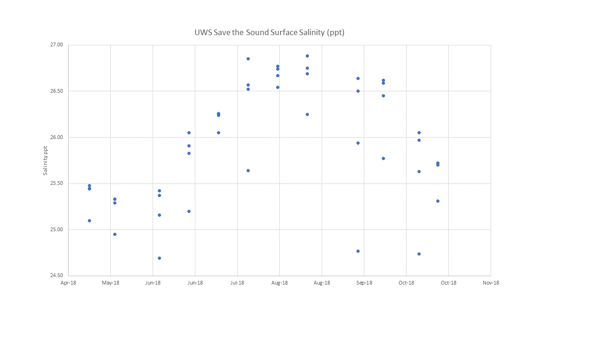

# KEL notes
- Looking at this and thinking back, it seems very few have measured dd below 0. I'm wondering if we should increase it to ddb5 to make it a more meaningful metric.
- KEL and TB talked about the max/min given sparse data, we decided temp is ok, but salinity should be NA
  - We decided this was a "High" site
- TO DO: Add number of months as fraction
  - Change data names to "High" in other data sheets

# Map of populations (marked with a P) and datasource locations:

https://www.google.com/maps/d/edit?mid=1paClfxbz7rbNH6Dyh37e8K_XS2DTiXeY&usp=sharing

> NY locations are not defined as High, Med or Low. 

> Lat/long for location NY_LI_CM_XXX_W give a site on land.

> The same temperature and salinity primary datasources are listed for both locations, without alternative sources. 

## COMPARE SOURCES
> Temperature datasource listed for these two populations is a NOAA buoy "National data Buoy center 44040 Western Long Island Sound"; Salinity datasource listed for both populations is Save the Sound, https://www.savethesound.org/water-monitoring-ecological-health, 2018_UWS_Data.xlsx.

> That means no datasources to compare. 

# PopID: NY_LI_LH_XXX_W and NY_LI_CM_XXX_W - Temperature
* Erin's notes: NBDC buoy Historical data is available for this buoy from 2004 to 2019. Includes temperature but not salinity. Data is from Jan-Dec.
* Thais's notes: NBDC files only show temperature data for years 2004 and 2005. Other data available 2006-19, but not temperature (nor salinity). Confirmed by checking the source website. 2004 is missing Oct9-Dec14; 2005 is missing Nov10-Dec31 **Should I look for a new location to replace this? (ask Katie)**

# Plot of all temperature data available for both NY populations

| Parameter               | NOAA_44040 all yrs   | NOAA_44040 whole yrs  |
| ----------------------  | :------------------: | :-------------------: |
| N_all_datapoints        |       10863          |      NA               |
| Mean_all_datapoints     |        13.3          |      NA               |
| StdDev_all_datapoints   |        8.2           |      NA               |
| N_years                 |         2            |      NA               |
| Mean_yearly_max         |          27.7        |      NA               |
| Mean_yearly_min         |          0           |      NA               |
| Mean_yearly_dd_0        |          0           |      NA               |
| Mean_yearly_dd_15       |          140.0       |      NA               |
| Mean_yearly_dd_30       |         0            |      NA               |
| Data range & resolution |  2004-05, hourly     |      NA               |

# PopID: NY_LI_LH_XXX_W and NY_LI_CM_XXX_W - Salinity
* Erin's notes: Stations of interest for UWS data are HNC-LLO-01, HNC-LLO-02, HNC-LLO-03, HNC-LLO-04. Data available May-October for 2018 data is two readings per month.

# Plot of all salinity data available for both NY populations

## Summary table of salinity data and whole years only 

| Parameter               |UWS SavetheSound all yrs|UWS SavetheSound whole yrs|
| ----------------------  | :--------------------: | :----------------------: |
| N_all_datapoints        |       48               |              NA          |
| Mean_all_datapoints     |       25.9             |               NA         |
| StdDev_all_datapoints   |       0.6              |               NA         |
| N_years                 |       <1               |                  NA      |
| Mean_yearly_max         |        26.9            |                 NA       |
| Mean_yearly_min         |        24.7            |              NA          |
| Data range & resolution |  2018, 2x / month      |              NA          |

