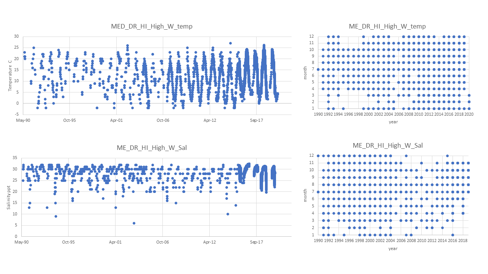

# Pop ID: ME_DR_HI_High_W

## Map:

Lat/long for this population is exact; 

Lat/long for Hog Island is not listed by Erin but is in the datafile so I assume it is exact; 

Lat/long for Upper Damaricotta and dockdata are listed by Erin but does not say if exact or approximate.

https://www.google.com/maps/d/edit?mid=1OiSklGJLcWVodJQ1RF-YQ6gr1y6NxpIh&ll=44.18825219512222%2C-69.11313829785156&z=10

## Summary notes:

**Temp: combine from 3 sources: Hog Island (3 stations, pre-combined), Upper Damariscotta and DockData (all years).**

**Sal: combine from 2 sources: Hog Island (3 stations, pre-combined) and Upper Damaricotta (all years - KEL notes says 'Hog Island whole years', but I think it's a typo and I used all years).**

- The overall data range is 1990-2020 and the datas sources overlap in 2015-2016.
- Data frequency is different for each source: monthly for Hog Island, hourly for Upper Damariscotta and multiple times (but not daily or weekly) per month for DockData.
- Many but not all winter months are missing.

(see details on each source in entry dated 2020-10-20)

## Summary table:

| Parameter             | Temp C Hog UDamaris Dock combined |     Sal ppt Hog UDamaris combined |
| ----------------------| :-------------------------------: | :-------------------------------: |
| N_all_datapoints      |               20762               |                 19636             |
| Mean_all_datapoints   |                  15.7             |                  29.9             |
| StdDev_all_datapoints |                   5.3             |                   2.0             |
| N_years               |                  31               |                    30             |
| Mean_yearly_max       |                 22.4              |                    31.5           |
| StdDev_yearly_max     |                   3.8             |                    0.7            |
| Mean_yearly_min       |                    1.6            |                    18.8           |
| StdDev_yearly_min     |                   4.7             |                     5.4           |
| Data range            |  1990-2020 but see summary notes  |  1990-2019 but see summary notes  |
| Data frequency        |hourly to monthly see summary notes|hourly to monthly see summary notes|
| Missing winter        |    FALSE but see summary notes    |      FALSE but see summary notes  |

## Datasources and filenames:

Website: NA

Temp: ME_DR_HI_High_W_temp.xlsx

Sal: ME_DR_HI_High_W_sal.xlsx

## Plots: all data over time and data availability per month per year (this helps visualize the 'missing winter' question and other gaps in data) (simple plots made in excel).

